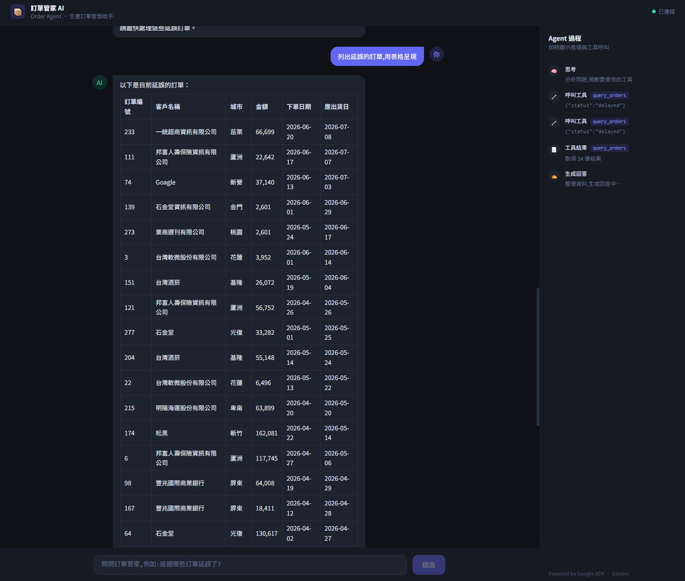
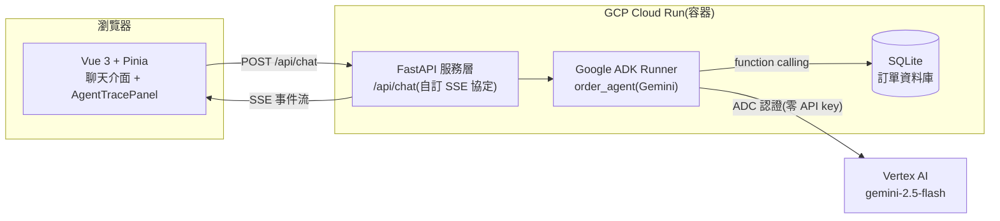

# 訂單管家 AI(Order Agent)

一個生產訂單管理的 AI Agent:用自然語言查訂單、看統計、標記延誤,並**即時可視化 Agent 的推理過程與工具呼叫**。

**🔗 線上 Demo:https://order-agent-56007855094.asia-east1.run.app**
(部署於 GCP Cloud Run 台灣機房;閒置會縮到零實例,第一次開啟請等待數秒冷啟動)



## 可以問它什麼

- 「這週哪些訂單延誤了?」→ Agent 會先查今天日期、自己推算區間、再帶參數查資料庫
- 「哪個客戶貢獻的營收最高?用表格呈現」
- 「幫我標記所有逾期的訂單」→ 涉及資料修改,Agent 會**先向你確認才執行**

右側的「Agent 過程」面板會即時顯示每一步:🧠 思考 → 🔧 呼叫工具(含參數)→ 📄 工具結果 → ✍️ 生成回答。

## 架構



**資料流**:使用者提問 → FastAPI 把 ADK Runner 的原始事件流「翻譯」成自訂 SSE 協定 → 前端一條連線同時餵兩個視圖(文字事件 → 聊天泡泡打字機;工具事件 → 推理過程側欄)。

### 自訂 SSE 事件協定

後端不直接暴露 ADK 的內部事件格式,而是在服務層收斂成六種語意明確的事件(防腐層):

| type          | 語意           | 前端行為                       |
| ------------- | -------------- | ------------------------------ |
| `delta`       | 逐字文字片段   | 追加(打字機效果)               |
| `text`        | 段落完整彙總   | 覆蓋(避免 partial 重複)        |
| `tool_call`   | Agent 呼叫工具 | 側欄新增步驟(含參數)           |
| `tool_result` | 工具執行結果   | 側欄顯示摘要(如「取得 12 筆」) |
| `done`        | 本輪結束       | 收尾                           |
| `error`       | 錯誤           | 錯誤狀態 UI(不會無聲斷線)      |

## 本機開發

需求:Python 3.11+、Node.js 22+、gcloud CLI(已 `gcloud auth application-default login`)

```powershell
# 後端
python -m venv .venv
.\.venv\Scripts\Activate.ps1
pip install -r requirements.txt
python db/init_db.py      # 建表
python db/seed.py         # 灌 300 筆模擬訂單(random.seed 固定,可重現)
# 設定 my_agent/.env:GOOGLE_GENAI_USE_VERTEXAI=TRUE、GOOGLE_CLOUD_PROJECT、GOOGLE_CLOUD_LOCATION
uvicorn server.main:app --port 8000

# 前端(另一個終端機)
cd frontend
npm install
npm run dev               # http://localhost:5173(/api 由 Vite proxy 轉發到 8000)
```

## Docker

```powershell
docker compose up --build   # http://localhost:8000(前端由 FastAPI 同容器供應)
```

多階段建置:node 映像只負責打包 Vue,最終 python 映像僅含 dist 成品;金鑰與本機資料庫不進映像;容器監聽 `${PORT:-8000}`(相容 Cloud Run 的 PORT 注入合約)。

## 部署(Cloud Run)

```powershell
gcloud run deploy order-agent --source . --region asia-east1
```

前置(一次性):啟用 `aiplatform.googleapis.com`、給預設服務帳戶綁 `roles/cloudbuild.builds.builder` 與 `roles/aiplatform.user`、環境變數設 Vertex 三變數。

## 專案結構

```
order-agent/
├── my_agent/          # Agent 定義(instruction、工具掛載)+ tools.py(4 個工具)
├── server/            # FastAPI 服務層:/api/chat 自訂 SSE 協定
├── db/                # schema.sql、seed、SQLite
├── tests/             # pytest(8 個測試)
├── frontend/          # Vue 3 + TS + Pinia + UnoCSS
│   └── src/
│       ├── api/agent.ts       # SSE 解析(fetch + ReadableStream + buffer)
│       ├── stores/            # chat(訊息生命週期)、trace(推理步驟)
│       └── components/        # ChatWindow / MessageBubble / MessageInput / AgentTracePanel
├── Dockerfile         # 多階段建置
└── docker-compose.yml
```
